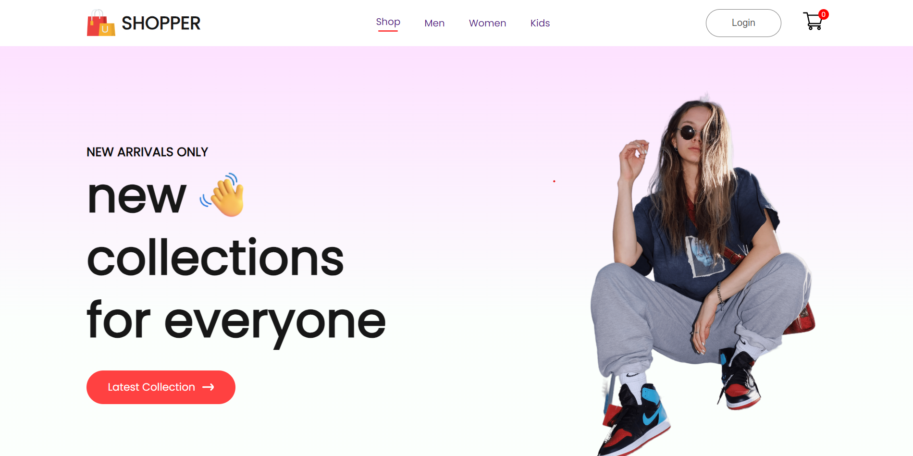

# Full Stack E-Commerce Website Using React JS, MongoDB, Express & Node JS 2024

## Overview

This project is on building a full-stack e-commerce website using the MERN stack (MongoDB, Express, React, Node.js). Frontend and backend development, including React functionalities, state management, routing, backend server setup, MongoDB database integration, and user authentication.

## Live Demo

Check out the live demo of the project: [E-Commerce Website](https://ecommerce-lu5n1fvp5-pratiktechies-projects.vercel.app/)

## Features

- **Navigation Bar:** Allows users to navigate to different pages.
- **Hero Elements:** Engaging hero elements to capture user attention.
- **Product Displays:** Showcase of popular and new collection products.
- **Exclusive Offers Banner:** Highlight exclusive offers for users.
- **Responsive Design:** Optimized for various screen sizes with media queries.

## Technologies Used

- **Frontend:** React JS
- **Backend:** Node JS, Express
- **Database:** MongoDB
- **State Management:** useState
- **Routing:** React Router DOM
